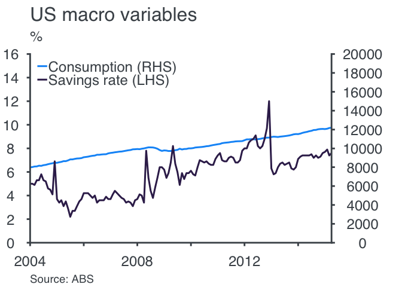

<!-- README.md is generated from README.Rmd. Please edit that file -->

# leplot

<!-- badges: start -->

<!-- badges: end -->

A package for drawing graphs in the Layman Economics blog style

## Installation

You can install the development version of leplot with:

``` r
# install.packages("devtools")
devtools::install_github("miguelayalar/leplot")
```

## Example

This is a basic example of a line plot:

``` r
library(leplot)
library(tidyverse)
#> ── Attaching packages ─────────────────────────────────────── tidyverse 1.3.1 ──
#> ✓ ggplot2 3.3.5     ✓ purrr   0.3.4
#> ✓ tibble  3.1.6     ✓ dplyr   1.0.8
#> ✓ tidyr   1.2.0     ✓ stringr 1.4.0
#> ✓ readr   2.1.2     ✓ forcats 0.5.1
#> ── Conflicts ────────────────────────────────────────── tidyverse_conflicts() ──
#> x dplyr::filter() masks stats::filter()
#> x dplyr::lag()    masks stats::lag()

economics_long %>% 
  dplyr::select(-4) %>%
  filter(variable %in% c('psavert', "pce")) %>% 
  leplot_line(a =., 
              ttl = "US macro variables",
              x_break = "2 year",
              leg = c('Consumption (RHS)', 'Savings rate (LHS)'),
              lh_units = "%", 
              x_range = c(2004, 2016), 
              y_range = c(0, 16, 2),
              leg_col = 1,
              #leg_pos = c(0.25, 0.88),
              rh_units = "Billions ($)",
              nudge_rh_units = 0.2,
              rhs_var = 'pce',
              y2_range = c(0, 2e+04, 2e+03),
              invert_axis = 0,
              thm = 'le_theme')
#> Roboto Condensed font not found; install with hrbrthemes::import_roboto_condensed()
#> Warning: Removed 876 row(s) containing missing values (geom_path).
```



This is a basic example of a column plot:

``` r

ctry <- rep(c("AUS", 'US', "UK", "NZ"), 3)
yr <- c(rep("2019", 4),rep("2020", 4), rep("2021", 4))

m <- data.frame(category = ctry, variable = yr, value = runif(12))


leplot_col(m, ttl = 'Seminal ggplot2 column chart example', 
                lh_units = "Countries", 
                y_range = c(0,1.5,.3), 
                flip = 1, stack = 0, 
                leg_pos = c(0.9, 0.9))
#> Roboto Condensed font not found; install with hrbrthemes::import_roboto_condensed()
```


